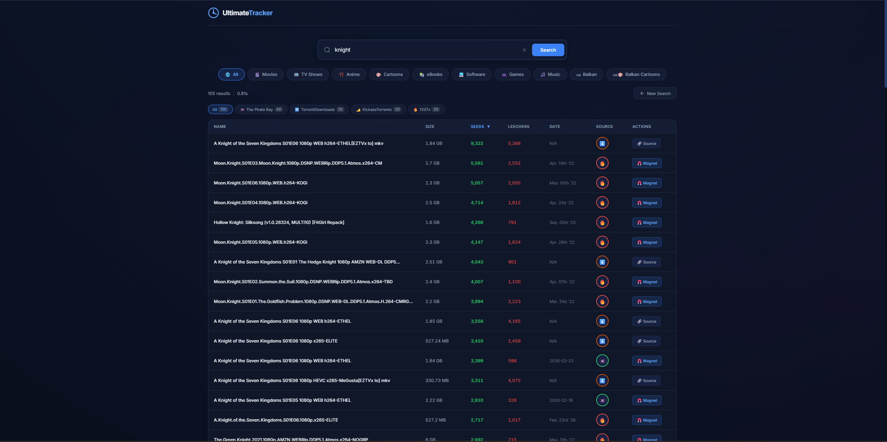
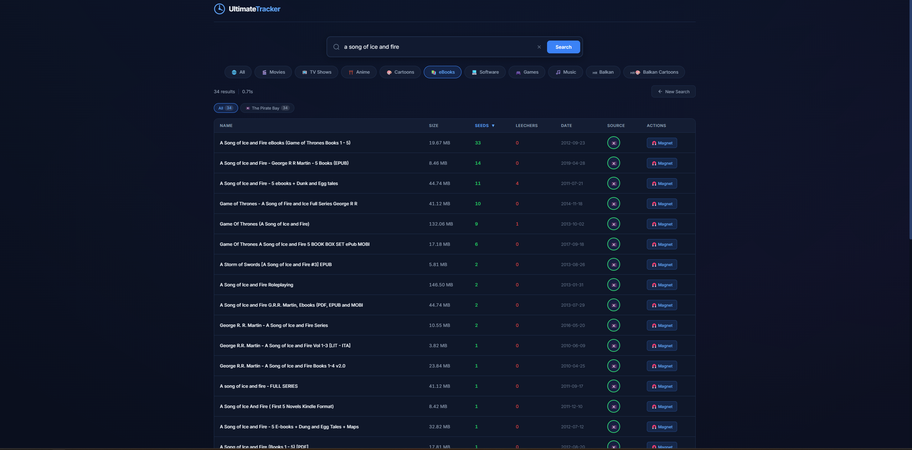

# UltimateTracker

A personal torrent meta-search aggregator that searches 15+ torrent sites simultaneously and displays results in a single interface.


## Screenshots

### Search across all sources


### Category filtering (eBooks)


## Features

- **Multi-source search** — queries 15+ torrent sites at once
- **Real-time results** — results stream in as each source responds (SSE)
- **Per-source progress bars** — see which sources are still loading
- **Category filtering** — Movies, TV Shows, Anime, Cartoons, eBooks, Software, Games, Music, Balkan, Balkan Cartoons
- **Sortable columns** — click any column header to sort results
- **Magnet links** — one-click magnet links for every result
- **Relevance filtering** — multi-word queries match all significant words
- **Balkan/Croatian content** — dedicated Balkan sources and category filters
- **Dark blue theme** — easy on the eyes

## Sources

PirateBay, 1337x, TorrentGalaxy, LimeTorrents, KickassTorrents, GloDLS, TorrentDownloads, YTS, EZTV, Nyaa, AniDex, BalkanDownload, CroTorrents, and more.

## Quick Start

### Prerequisites

- [Node.js](https://nodejs.org/) (v16 or newer)
- [Git](https://git-scm.com/)

### Installation

```bash
# Clone the repo
git clone https://github.com/zerocode777/UltimateTracker.git
cd UltimateTracker

# Install dependencies
npm install

# Start the server
npm start
```

Open **http://localhost:7777** in your browser. That's it.

### Development

To auto-restart the server on file changes:

```bash
npm run dev
```

## Usage

1. Type a search query in the search bar
2. (Optional) Click a category to filter results
3. Results stream in from all sources with progress indicators
4. Click the magnet icon to open a torrent in your client
5. Click column headers to sort by name, size, seeds, etc.

## Tech Stack

- **Backend:** Node.js, Express
- **Scraping:** Cheerio, node-fetch
- **Frontend:** Vanilla HTML/CSS/JS
- **Streaming:** Server-Sent Events (SSE)

## License

MIT
